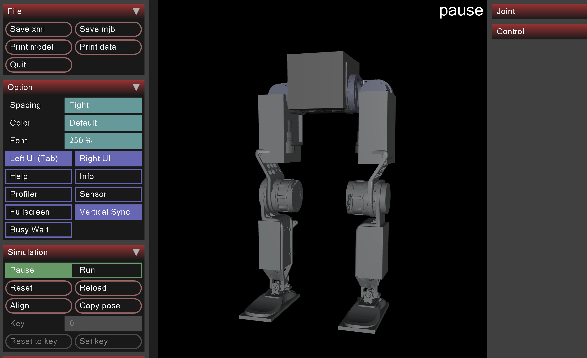
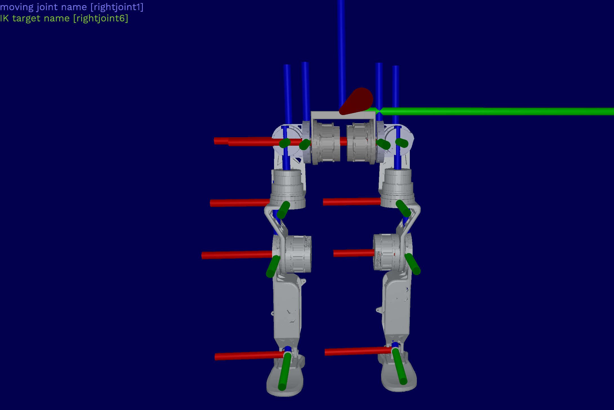

# URDF & XML for Alexbotmini
Use the latest URDF (the one with the largest number)!!!
In this URDF, the collision objects have been simplified, the orientation of the base link with respect to the IMU has been refined, and the joint data has been restricted. It includes the Alexbotmini (version without upper body chassis) and the version with an upper body chassis (to be optimized). At the same time, export the XML file for use in Mujoco. This repository is derived from the Alexbotmini_hardware repository. The URDF files in this repository are adapted for seamless use with the Alexbotmini_deploy repository.

)

